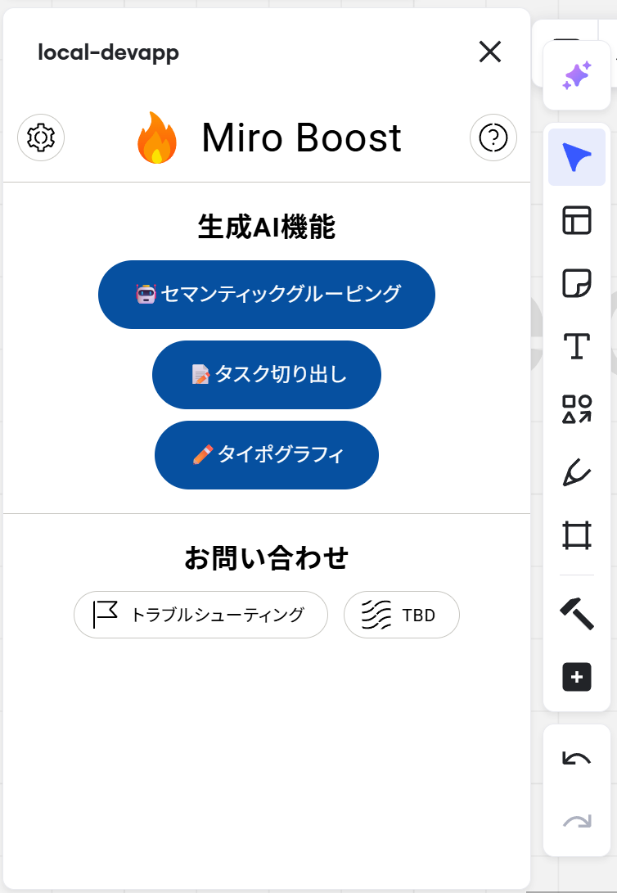
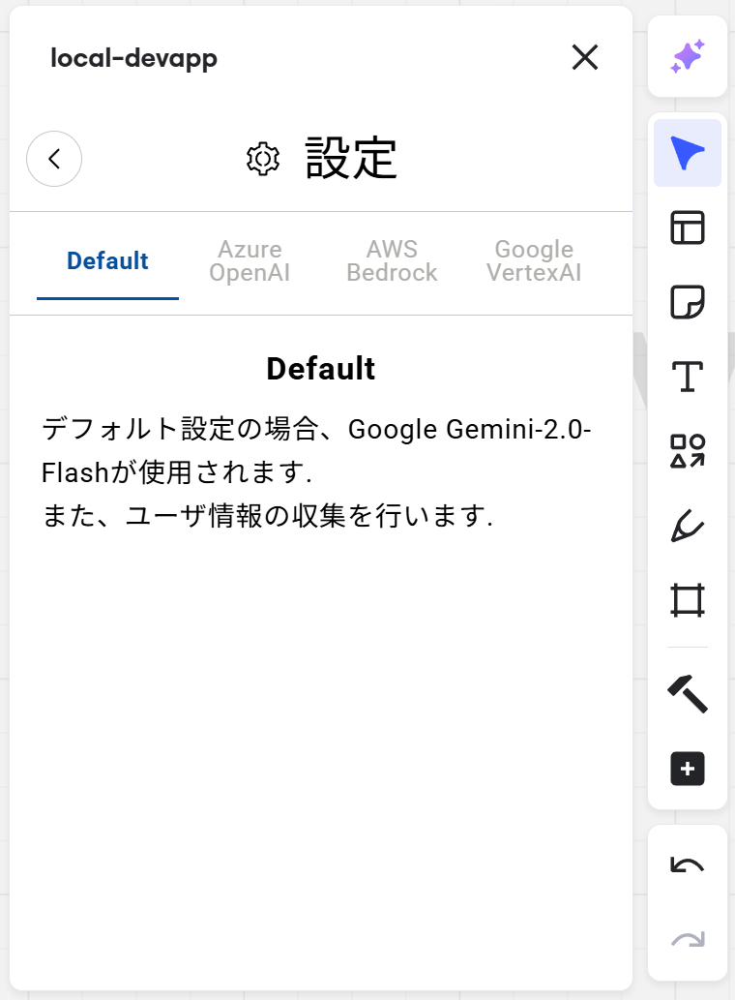
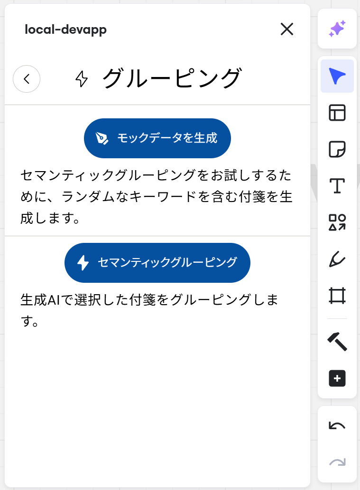
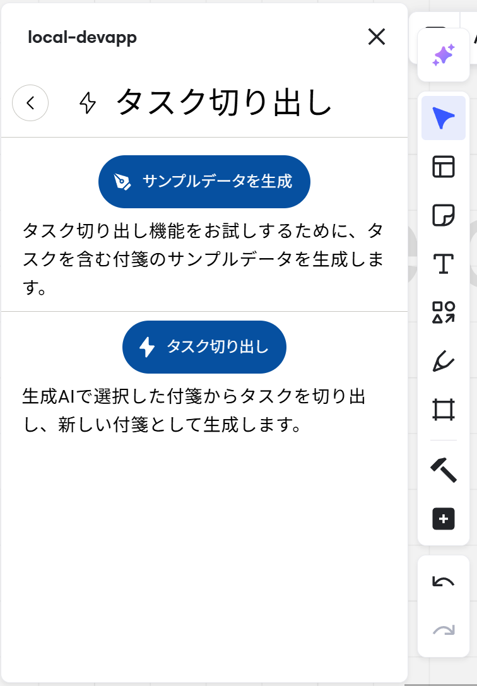
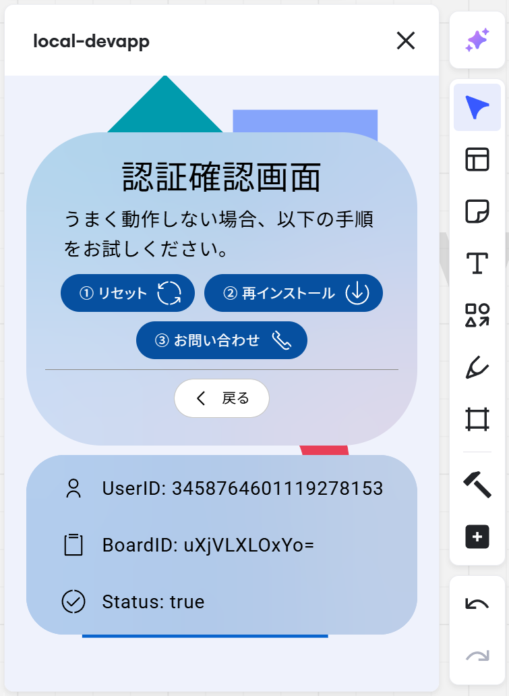
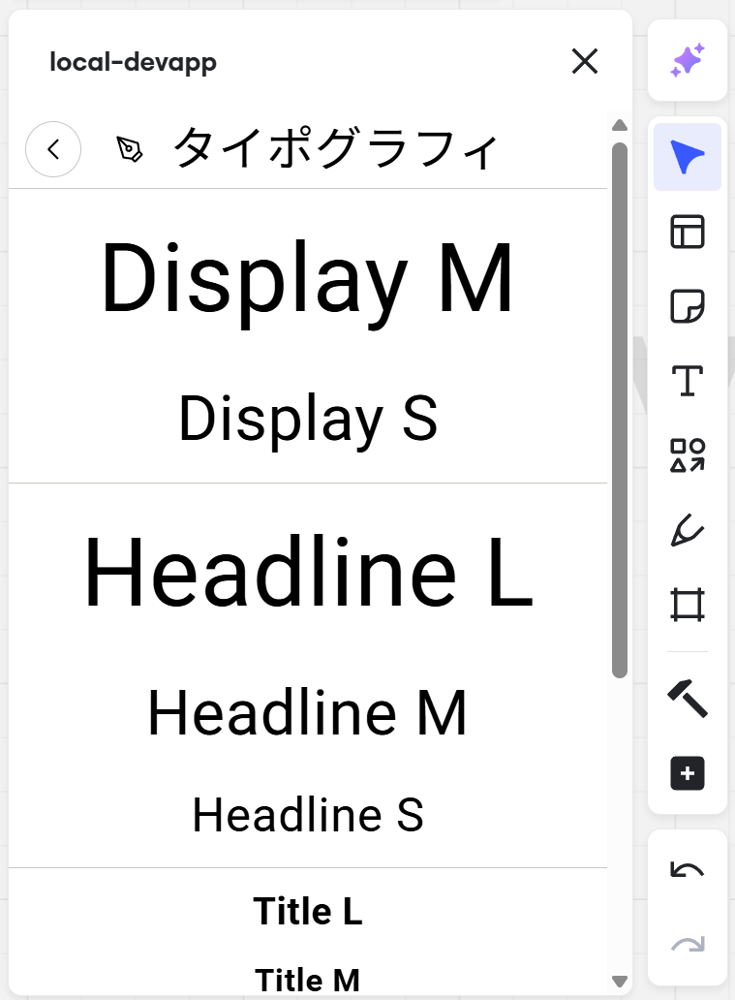
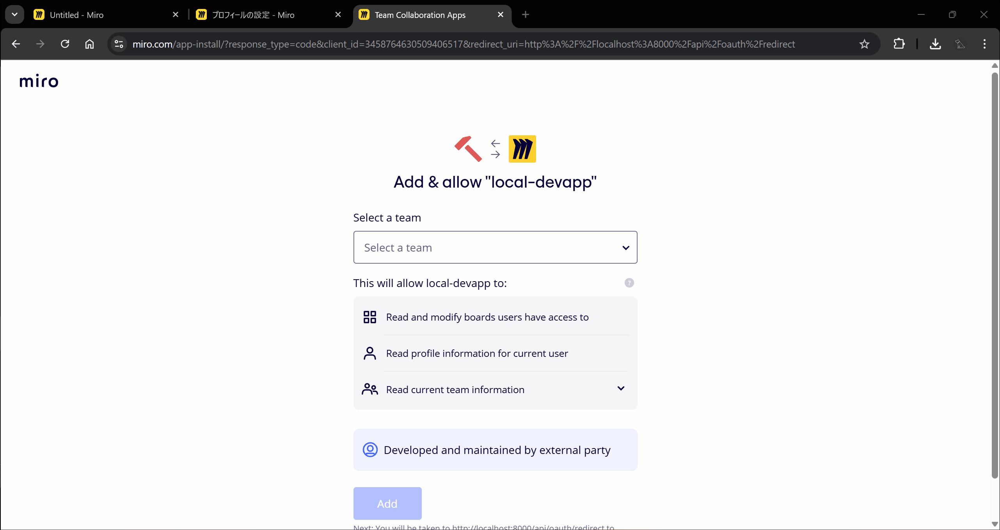
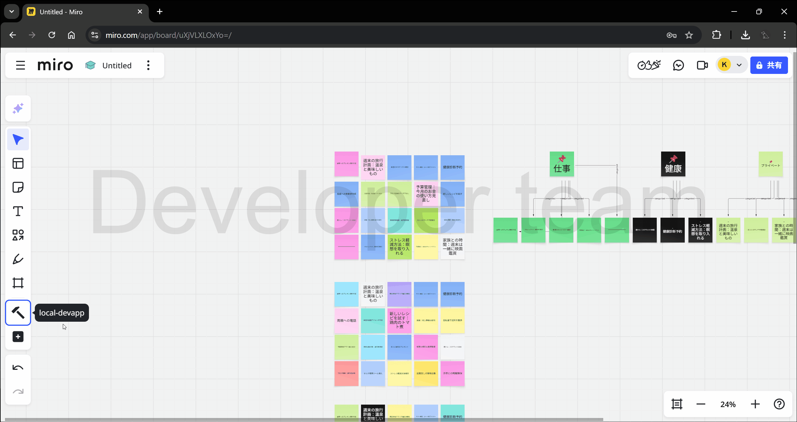

<!-- # Miro Speedtest -->

## 技術スタック

- フロントエンド
  - [TypeScript](https://www.typescriptlang.org/docs/)
  - [React](https://react.dev/reference/react)
  - [ReactDOM](https://react.dev/reference/react-dom)
  - [React Router](https://reactrouter.com/start/framework/routing)
  - [Vite](https://vite.dev/guide/)
  - [Serendie Design System](https://serendie.design/components/)
  - [Miro WEB SDK](https://developers.miro.com/docs/sdk-reference)
- バックエンド
  - [Python](https://www.python.org/)
  - [LangChain](https://python.langchain.com/docs/how_to/)
  - [AWS Bedrock](https://python.langchain.com/docs/integrations/providers/aws/)
  - [Azure OpenAI](https://python.langchain.com/docs/integrations/chat/azure_chat_openai/)
  - [Google Generative AI](https://python.langchain.com/api_reference/google_genai/)
  - [FastAPI](https://fastapi.tiangolo.com/)
  - [Miro REST API Python Client](https://miroapp.github.io/api-clients/python/miro_api.html)
  - [Miro REST API](https://developers.miro.com/reference/overview)

## Screenshot

## Demo

- 汎用機能
  - 要点まとめ
    - Miroボードと議事録テキストとその他資料(Word/PowerPoint/PDF)から、要点をまとめる
  - 意見のグルーピング

- スクラム機能
  - プロダクトバックログを作成
    - プロダクトバックログアイテムを作成
      - ユーザストーリーを作成
        - 「私がペルソナなら、希望を実行することで目標を達成したい」という形式で書くこと
        - この機能を求めているユーザのペルソナ・希望・目標を明確にすること
        - この機能を求めているユーザが複数人いる場合、ユーザストーリーも複数作成する
      - 受け入れ条件を作成
      - 完成の条件を作成
        - コードレビューが完了済み
        - 単体(ユニット)テスト・結合(インテグレーション)テスト・E2Eテストをパス
        - テスト環境にデプロイ済み
      - プロダクトバックログアイテムの優先度を最高・高・中・低・最低から選択する
      - プロダクトバックログアイテムのストーリーポイントを見積もる
      - フィボナッチ数の「1、2、3、5、8、13、21、34」 から見積もる
  - スプリントバックログを作成
    - プロダクトバックログからスプリントバックログを作成
      - プロダクトバックログから優先度の高いアイテムを詳細化
    - 入力として与えられた、スプリントの平均ストーリーポイントが超過するまで、プロダクトバックログアイテムをスプリントバックログに追加する
  - プロダクトバックログアイテムを詳細化
    - プロダクトバックログアイテムをタスクに分割
    - 各タスクにストーリーポイントを割り当てる
      - フィボナッチ数の「1、2、3、5、8、13、21、34」 から見積もる
      - 1は、ジュニアエンジニアが半日かかるタスクと考えて下さい

- デモ機能
